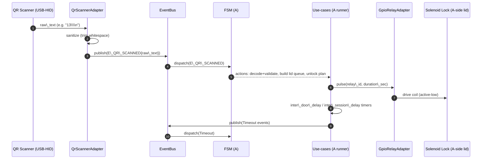
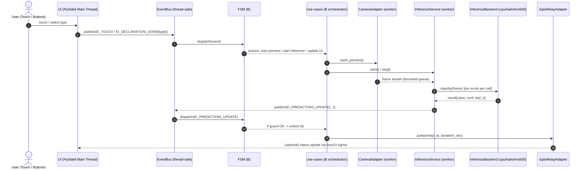
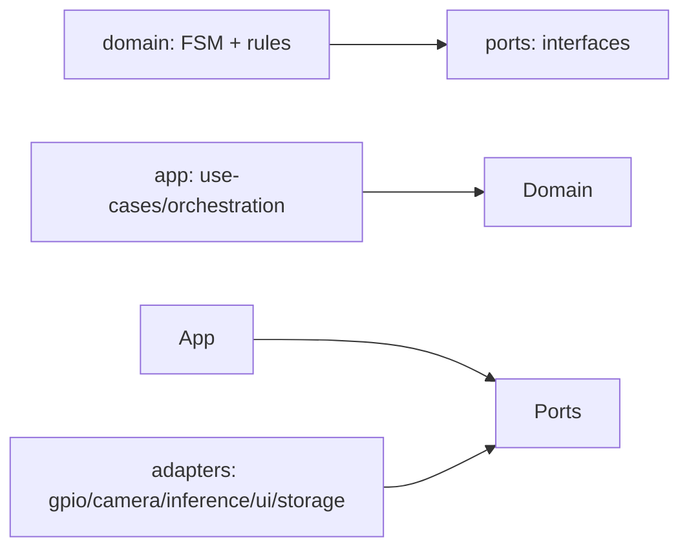

# Akıllı Atık Ayrıştırma Sistemi – README (Tek Doküman)

> Bu README; `README\_v2.md`, `CURRENT\_DECISIONS.md`, `HARDWARE\_MAPPING.md`, `AGENTS\_v2.md` ve `corum\_05\_master.md` içeriğinin \*\*FSM haricinde\*\* birleştirilmiş halidir.
> FSM geçiş tablosu ayrı dosyadadır: \*\*`FSM\_SPEC\_EXTRACT.md`\*\*.
> Çelişki çözümü: `corum\_05\_master.md` ile çelişen yerlerde bu README’deki güncel kararlar esas alınmıştır.

## Geçerli Kararlar (Source of Truth)

Bu README, önceki dokümanların (özellikle `corum\_05\_master.md`) **birleştirilmiş ve çelişkileri çözülmüş** halidir.
Çelişki olursa bu README’de yazanlar geçerlidir.

* **Mimari:** Hexagonal (Ports \& Adapters) + event-driven FSM
* **FSM:** Ayrıntılı geçiş/tablo dokümanı ayrı dosyada tutulur: `FSM\_SPEC\_EXTRACT.md`
* **Sınıflar (6):** `plastic`, `glass`, `metal`, `biodegradable`, `paper`, `non\_recyclable`
* **Gerçek çalışma koşulu:** sabit ışık, sabit arka plan, tek nesne, yerel veri ile fine-tune
* **Inference stratejisi:** `cpu` / `hailo` / `imx500` seçilebilir (3 backend)


## Projenin Amacı (Project Goal)

* **Amaç (goal):** Atıkların (waste) yanlış kutuya atılmasını **engellemek (preventing mis-sorting)** ve kullanıcıyı **eğiten (educational)** bir sistem kurmak.
* Mevcut “sıfır atık (zero waste)” uygulamalarında:

  * İnsanlar çoğunlukla **yanlış kutuya atıyor (mis-sorting)**,
  * Depozito makineleri (deposit machines) ve mobil atık merkezleri (mobile collection units) **genellikle düşük kullanıma sahip (low usage)**,
  * Kullanıcı hatasını sistem düzeltiyor; kullanıcı ne yaptığını fark etmiyor.

* **Bizim farkımız (key difference):**

  * Sistem sadece **“doğru / yanlış” geri bildirimi (feedback)** veriyor ve kullanıcıdan doğru seçimi yapmasını bekliyor (**kullanıcı kararı (self-decision)**),
  * Kullanıcı yanlış seçim yaparsa, kullanıcının kendi hatasını düzeltebilmesi için **yeniden deneme (retry)** imkânı sunuyor,
  * Enerji tüketimi (energy consumption) çok düşük olacak.


## Atık Sınıfları (6 Class)

* `plastic`
* `glass`
* `metal`
* `biodegradable`
* `paper`
* `non\_recyclable`


## Yazılım Yığını (Software Stack)

### İşletim sistemi (OS)

* **Raspberry Pi OS Trixie** (Debian 13 tabanlı), **64-bit**
* Kernel sürümü ve exact image/release bilgisi, kurulu imaja göre değişebilir. (Legacy notlarda kernel 6.12 ve 2025-12-04 referansı geçer.)

### Dil ve UI

* **Python**
* **GUI:** **PySide6** (Qt)

### Görüntü modeli (Vision Model)

* Görev tipi: **sınıflandırma (classification)**
* Adaylar (TBD):

  * **YOLO11n/YOLO11ns classification** (Ultralytics)
  * **YOLOv8n classification** (Ultralytics)

* Çalışma koşulu: **sabit ışık + sabit arka plan + tek nesne**; yerel veri ile fine-tune.

### Inference / Hızlandırma (kritik karar)

Tek kod tabanı + konfigürasyon ile **3 inference backend** seçilebilir:

* `cpu` — Raspberry Pi 5 üzerinde (referans/fallback)
* `hailo` — AI HAT+ (Hailo-8) üzerinde (opsiyonel hızlandırma)
* `imx500` — AI Camera (IMX500) sensör üzerinde (opsiyonel hızlandırma)

> Önemli: “tek model dosyası her backend’de çalışsın” hedeflenmez. \*\*Backend başına ayrı model artefact’ı\*\* (ör. CPU için ONNX/PT, Hailo için HEF, IMX500 için deploy paketi) beklenir.

Backend değişimi **hot-swap yerine** güvenli durumda (tercihen IDLE state) **clean restart** ile uygulanır.

### Ağırlık sensörü (Weight) – v0.1 yaklaşımı

* v0.1’de gerçek load cell kullanılmayabilir; yazılım “weight present/absent” event kavramını korur.
* v0.1’de bu event’ler **BUTTON\_KOY / BUTTON\_CEK** ile simüle edilebilir (B.YOLU akışında detay var).

### QR/Barkod okuyucu bağlantısı

* (5) GM67 QR/Barkod okuyucu, genellikle **USB-HID keyboard** gibi davranır.
* Payload sonunda `Enter/newline` gelip gelmeyeceği net değil; cihaz yazılımı sonda gelen whitespace/newline’ı güvenle ignore etmelidir.

### Görseller (images) notu

* Codex yükünü artırmamak için görseller zorunlu değildir.
* Repo’ya görsel eklenecekse dosya adları için: **boşluksuz + ASCII** (örn. `Sekil\_8\_Dokunmatik\_Ekran\_2.png`).


## Mimari (Hexagonal + Event-Driven FSM)

### Neden bu mimari?

* UI (PySide6), donanım (GPIO/relay), inference runtime ve FSM birbirine yapışırsa, her donanım değişikliği “yeniden yazım” acısı üretir.
* Hexagonal mimari ile:

  * **Domain (çekirdek)**: FSM + kurallar + event’ler, dış dünyadan bağımsızdır.
  * **Ports**: çekirdeğin ihtiyaç duyduğu arayüzlerdir (`InferencePort`, `CameraPort`, `StoragePort`, `TelemetryPort`, `ClockPort`…).
  * **Adapters**: IMX500/Hailo/CPU, kamera, GPIO, UI, storage gibi dış dünyaya bağlanan implementasyonlar.

### Event-driven FSM yaklaşımı

* UI doğrudan state değiştirmez; **event yayınlar**.
* FSM state transition yapar; use-case katmanı gerekli aksiyonları tetikler:

  * inference start/stop
  * relay unlock pulses
  * UI update
  * persist/log/telemetry

### Threading / performans (temel kural)

* UI thread asla bloklanmaz.
* Inference ayrı thread/process’te koşar.
* Frame kuyruğu **bounded** olmalı (unbounded queue yok).
* Kamera kareleri “hot path”te diske yazılıp geri okunmaz (örn. `rpicam-still` ile dosyaya snapshot almak yok); mümkün olduğunca RAM içi stream/pipeline kullanılır.
* Kararlılık için (opsiyonel): EMA / `N\_STABLE\_FRAMES` gibi stabilizasyon uygulanabilir (B.YOLU Ekran3 kuralları bunu zaten kullanır).


## Data Flow, Bağımlılık (Dependency) ve Kütüphane Politikası

Bu bölüm “kodlamadan önce mutabakat” içindir. Amaç:

* **Data flow’u** (veri + kontrol akışı) netleştirmek → “kim kimi çağırır / kim kimi bekler?” sorusu sürpriz üretmesin.
* **Bağımlılık sınırlarını** (dependency rules) yazmak → domain’in adapter’lara yapışması engellensin.
* **Kütüphane/3rd-party bağımlılık politikasını** yazmak → Raspberry Pi üstünde sürpriz kurulum/uyumsuzluk döngüsü yaşanmasın.
* Eski yazılımda yaşanan klasik sorunlar (UI donması, dosya tabanlı kamera I/O, her inference çağrısında yeniden init, hard-coded config) tekrar oluşmasın.

> Not: Diyagramlar için Mermaid kullanımı önerilir. Mermaid; Markdown içinde ` ```mermaid ` code block ile çizim üretir. (GitHub ve birçok araç destekler.) 

### 4.1 Data Flow – A.YOLU (QR) (event → FSM → relay)

A.YOLU’nda kullanıcı etkileşimi cihaz UI’sından değil, QR okuyucudan (USB-HID) gelir.



**A.YOLU kritik sözleşmeler (contracts):**

* QR okuyucu “Enter/newline” ekleyebilir → **trailing whitespace güvenle ignore edilir**.
* QR parse sonucu yalnızca `1..63` aralığında valid.
* Bit mask → kapak kuyruğu **sabit öncelik sırası** ile (25→24→23→22→21→20).
* Session queue: aktif oturum varken yeni QR gelirse **enqueue** (FIFO).
* “Unlock” yalnızca **pulse** komutudur; “close” komutu yoktur (kapak mekanik kapanır).


### 4.2 Data Flow – B.YOLU (Touchscreen + Camera + Inference)

B.YOLU; UI, kamera akışı ve inference sonucunu **asenkron** birleştirir.



**B.YOLU kritik sözleşmeler (contracts):**

* UI thread **bloklanmaz**. Ağır işler worker thread/process’te.
* Kamera görüntüsü “hot path”te disk’e yazılıp geri okunmaz (file I/O yok) → RAM içi stream hedeflenir.
* Frame kuyruğu **bounded**: “en yeni kare”yi tercih et (latency düşük kalsın).
* Inference backend init (HEF load, device/pipeline init vs.) **process ömründe 1 kez**; her karede tekrar edilmez.
* “Late result” (placement\_done=false iken gelen inference sonucu) **ignore** edilir (FSM kuralı).

### 4.3 Eşzamanlılık (Concurrency) ve Röle Sürme Kuralları

Bu projede **aynı anda birden fazla röle pulse etmek mümkündür** (farklı kapaklar aynı anda açılabilir). Bu, sistem politikasına aykırı değildir.

Minimum güvenlik kuralları:

* **Aynı röle kanalı** için üst üste pulse çakıştırma yapılmaz (aynı kanala ikinci pulse gelirse: ya reddet ya queue’la; davranış net olmalı).
* **Farklı röle kanalları** aynı anda pulse edilebilir (SIMULTANEOUS mod ve A/B eşzamanlılığı bunu gerektirir).
* Röle kartı **active-low** olduğu için GPIO sürüş seviyesi adapter’da doğru çevrilir (domain bunu bilmez).

### 4.4 Bağımlılık Kuralları (Code Dependency Rules)

Hexagonal mimarinin “en kritik” kısmı: **kimin kimi import edebileceği**.



Kurallar:

* `src/domain` **asla** `src/adapters` import etmez.
* `src/ports` sadece arayüz tanımlar (Protocol/ABC). Implementasyon içermez.
* `src/app` orchestration’dır: domain’i çalıştırır, adapter’ları bağlar, event bus kurar.
* Adapter’lar (GPIO/kamera/inference/UI) yalnızca port sözleşmelerine uyar; domain mantığı taşımaz.

### 4.5 Port Sözleşmeleri (Contracts) – “Yazmadan Kodlama Yok”

Her port için aynı formatta mini “sözleşme” yaz. Bu, ileride adapter değiştirince sistemin kırılmasını engeller.

Önerilen şablon (kopyala-yapıştır):

```markdown
#### <PortName>Port

\*\*Amaç:\*\* (1-2 cümle)

\*\*Threading/Lifecycle:\*\*
- hangi thread/process’te çalışır?
- init/close ne zaman çağrılır?
- idempotent mi?

\*\*API:\*\*
- method signatures (pseudo)
- input/output tipleri

\*\*Zamanlama:\*\*
- timeout / rate limit / backpressure politikası

\*\*Hata Modeli:\*\*
- hangi hatalar port dışına sızmaz?
- hata olduğunda FSM hangi event’i görür? (E\_FATAL\_ERROR gibi)

\*\*Testability:\*\*
- mock adapter nasıl görünür?
- deterministic test için ClockPort ile ilişkisi
```

Bu repo için “minimum port seti” zaten PLANS.md’de listeleniyor (`InferencePort`, `CameraPort`, `GpioRelayPort`, `QrScannerPort`, `StoragePort`, `ClockPort`).

### 4.6 3rd-Party Kütüphane / Paket Yönetimi Politikası

Hedef: Raspberry Pi üzerinde “kurulum savaşı” yerine “deterministik” ortam.

**1) Tek gerçek kaynak:** `pyproject.toml` (PEP 621 formatında)  
**2) Versiyon aralığı:** PEP 440 uyumlu (Python ekosistem standardı)  
**3) Kilitlenmiş ortam (önerilir):** `pip-tools` ile `requirements.txt` üret (CI + Pi deploy için)

Örnek yaklaşım:

* Geliştirme: `pip install -e ".\[dev]"`
* Deploy: `pip-compile` ile lock’lı requirements → Pi üzerinde `pip install -r requirements.txt`

Örnek dosyalar (öneri):

```
pyproject.toml
requirements.in
requirements.txt        # pip-compile çıktısı (pinned)
requirements-dev.in
requirements-dev.txt    # pip-compile çıktısı (pinned)
```

> Not: `pip-compile`, bağımlılıkları kaynak dosyadan deterministik bir `requirements.txt` dosyasına “compile” eder.

### 4.7 Konfigürasyon Şeması (Config Schema) ve Validasyon

Config tek yerde (örn. `config/app.toml`) olmalı. Ama “anahtar adları” ve “tipler” de net olmalı; yoksa typo yüzünden cihaz sahada saçmalar.

Öneri:

* `config/app.toml` → runtime config
* `src/app/config\_schema.py` → schema + validate (startup’ta fail-fast)

Örnek (pseudo):

```python
# validate\_config(config) -> raises ConfigError
# - required keys
# - type checks
# - range checks (e.g. 0 <= conf <= 1)
```

### 4.8 Log / Telemetri: Debug Edilebilirlik Sözleşmesi

Minimum hedef: “neden kapak açıldı/açılmadı?” sorusuna log’dan cevap.

Öneri: JSONL (satır satır JSON) event log.

Örnek kayıt:

```json
{"ts\_utc":"2026-01-30T12:34:56Z","path":"B","session\_id":"...","state\_from":"B\_SCREEN2","event":"E\_PREDICTION\_UPDATE","guard":"match\&\&conf\_ok","action":"UNLOCK","lid":"glass","backend":"cpu","conf":0.78}
```

### 4.9 Deployment Notu (Pi): systemd ile servisleşme

Pi üzerinde hedef: boot sonrası otomatik açılış + crash recovery.

Örnek systemd servis taslağı (placeholder):

```ini
\[Unit]
Description=Smart Waste Sorter
After=network.target

\[Service]
Type=simple
WorkingDirectory=/opt/sorter
ExecStart=/opt/sorter/.venv/bin/python -m src.main
Restart=on-failure
RestartSec=2

\[Install]
WantedBy=multi-user.target
```

### 4.10 ADR (Architecture Decision Records) – Kararların “Neden”i

Büyük kararları (kamera kütüphanesi seçimi, inference runtime seçimi, log formatı, config formatı, vs.) kısa ADR’larla kaydetmek çok işe yarar.

Klasör önerisi:

```
docs/adr/
  0001-camera-library.md
  0002-inference-runtime.md
  0003-logging-format.md
```

ADR şablonu:

```markdown
# ADR NNNN: <başlık>

## Durum
Proposed | Accepted | Deprecated

## Bağlam
Bu kararı neden konuşuyoruz? Hangi problem?

## Karar
Ne seçildi?

## Sonuçlar
Pozitif/negatif etkiler, riskler, takip işleri.
```


### 4.11 Runtime / OS Bağımlılıkları (Pi imajı için notlar)

Bu proje, “Python pip paketi” olmayan bazı OS bağımlılıklarına dayanabilir (kamera stack, sürücüler, GUI libs, vb.). Bu yüzden dokümana **en azından** şu iki listeyi eklemek iyi olur:

**(A) Zorunlu OS paketleri (örnek, TBD):**

* kamera stack (libcamera/Picamera2 ekosistemi)
* UI için gerekli Qt bağımlılıkları (PySide6 ile gelenler + sistem kütüphaneleri)
* GPIO erişimi için gerekli izinler/gruplar (örn. `gpio` grubu) ve udev kuralları

**(B) Opsiyonel OS paketleri (backend’e göre):**

* `hailo` backend: HailoRT ve sürücü bileşenleri
* `imx500` backend: sensör/stack ile ilgili bileşenler

> Bu listeyi “tam doğru” yapmak için hedef Pi imajında bir kez kurulum provası yapmak ve çıkan paket listesini buraya yazmak en güvenlisi.

### 4.12 Performans Bütçeleri (Performance Budget) ve Ölçümleme

Eski sistemde “kiosk hissi” bozulmasının ana sebebi, latency hedeflerinin yazılı olmamasıydı. Bu yüzden **ölçülebilir hedef** önerisi:

|Metrik|Hedef (TBD)|Nasıl ölçülür|
|-|-:|-|
|UI etkileşim tepki süresi|< 100ms|UI event → render|
|İlk preview karesi (touch-first)|< 300ms|start\_preview → first frame|
|İlk inference sonucu (place-first)|< 800ms|E\_WEIGHT\_PRESENT → E\_PREDICTION\_UPDATE|
|Unlock komutu gecikmesi|< 150ms|guard ok → relay pulse|
|Uzun süre çalışma stabilitesi|8+ saat|memory leak yok, CPU/ısı stabil|

Ölçüm pratikleri:

* Kritik noktaları log’la (timestamp’li) → latency dağılımını çıkar.
* FPS hedefinden çok **p99 latency** önemli (kiosk).

### 4.13 Hata Modları (Failure Modes) ve “Degrade” Politikası

Dokümanda şunlar net olmalı:

* Kamera yok / açılmıyor → B.YOLU “service” ekranı + retry + log, inference start edilmez.
* Hailo/IMX500 yok → otomatik CPU fallback (config izin veriyorsa) + UI’da durum göster.
* Inference timeout → E\_FATAL\_ERROR veya retry → UI donmadan devam.
* Röle sürülemedi (GPIO error) → safe stop + log + kullanıcıya açık hata.

Amaç: “Sahada fiziksel erişim yokken bile” log’dan teşhis edebilmek.

### 4.14 Güvenlik / Gizlilik (KVKK) – Minimum Çizgiler

* Görüntü kaydı (image logging) **default kapalı** kalır.
* Açılacaksa: explicit config flag + disk limiti + retention.
* QR input: sanitize + rate limit (spam scan durumunda session queue şişmesin).
* Loglar: PII/kişisel veri yazmama prensibi.

### 4.15 Sürümleme (Versioning) ve Uyumluluk

* Uygulama sürümü PEP 440 uyumlu olmalı (örn. `0.1.0`, `0.1.1`).
* Config şeması değişirse `config\_schema\_version` gibi bir alan eklemek iyi olur.
* Model artefact’ları için `model\_hash` veya `model\_version` log’lanır (hangi modelle karar verildiği belli olur).


## Repo Yapısı (önerilen)

```
.
├─ README.md
├─ FSM\_SPEC\_EXTRACT.md        # FSM geçişlerinin metin dökümü (ayrı dosya)
├─ pyproject.toml
├─ src/
│  ├─ app/                    # use-cases, orchestration, event bus wiring
│  ├─ domain/                 # FSM + domain kuralları + tipler
│  ├─ ports/                  # interface'ler (protocol/abc)
│  ├─ adapters/
│  │  ├─ inference\_cpu/
│  │  ├─ inference\_hailo/
│  │  ├─ inference\_imx500/
│  │  ├─ camera/
│  │  ├─ storage/
│  │  └─ ui\_pyside6/
│  └─ main.py
├─ assets/
│  ├─ models/
│  │  ├─ cpu/                 # örn: model.onnx veya .pt
│  │  ├─ hailo/                # örn: model.hef (+ configs)
│  │  └─ imx500/               # örn: packerOut.zip / deploy paketi
│  └─ labels/
├─ config/
│  └─ app.toml                # tek yerden runtime config
└─ tests/
```


## Kurulum (genel)

Bu repo, Python sanal ortamı ile çalışacak şekilde tasarlanmalıdır:

```bash
python -m venv .venv
source .venv/bin/activate
pip install -U pip
pip install -e ".\[dev]"
```

> Not: Hailo/IMX500 backend’leri donanıma ve sürücülere bağlıdır. Geliştirme sırasında CPU backend ile ilerlemek çoğu zaman daha az sürpriz üretir.


## Konfigürasyon (tek kaynak)

Tüm runtime ayarları `config/app.toml` gibi tek bir dosyadan okunmalıdır.

Örnek:

```toml
\[inference]
backend = "cpu"      # "cpu" | "hailo" | "imx500"

\[models]
cpu\_path    = "assets/models/cpu/model.onnx"
hailo\_path  = "assets/models/hailo/model.hef"
imx500\_path = "assets/models/imx500/packerOut.zip"

\[classes]
names = \["plastic","glass","metal","biodegradable","paper","non\_recyclable"]

\[ui]
fps\_limit = 20
```

### A.YOLU (QR) ile ilgili parametreler

* `unlock\_pulse\_duration\_sec` (default: **3s**) — solenoid kilidi kaç saniye tetiklenecek (pulse süresi)
* `inter\_door\_delay\_sec` (default: **1s**) — `SEQUENTIAL` modda kapaklar arası bekleme
* `inter\_session\_delay\_sec` (default: **0.5s**) — oturumlar arası bekleme
* `unlock\_mode` (default: **SEQUENTIAL**) — `SEQUENTIAL` | `SIMULTANEOUS` (FSM ile uyumlu)
* `unlock\_stagger\_sec` (default: **0.3s**) — sadece `unlock\_mode=SIMULTANEOUS` iken geçerli; `0` = tam aynı anda (fully simultaneous)
* `a\_sleep\_timeout\_min` (default: **15**) — A.YOLU inaktif kalınca kaç dakika sonra sleep’e geçer (FSM: 15 dk)


### B.YOLU (touchscreen+camera) ile ilgili parametreler

* Uyku (sleep) için idle timeout (legacy not: **1 saat**)
* Screen2 kabul eşiği: `CONF\_ACCEPT\_EKRAN2` (default: **0.50**)
* Screen3 kabul parametreleri:

  * `CONF\_ACCEPT\_EKRAN3` (default: **0.70**)
  * `CONF\_MIN\_IMPROVEMENT` (default: **0.05**)
  * `N\_STABLE\_FRAMES` (default: **2**)

* Retry / timeout parametreleri (FSM ile aynı isimler):

  * `retry\_inactivity\_timeout\_sec` (default: **15s**)
  * `max\_retry\_time\_sec` (default: **13s**)
  * `unlocked\_remove\_timeout\_sec` (default: **5s**)
  * `T1\_FIRST\_WINDOW\_SEC` (default: **10s**)
  * `T2\_SECOND\_WINDOW\_SEC` (default: **10s**)


* “preview warm” politikası (configurable): uyku modunda değilken kamera preview hattı ve model warm-up hazır bekletilebilir.

### Logging / Telemetry

* Varsayılan: **sayısal log** (timestamp, user\_type, class\_new, conf\_new, ekran akışı)
* Görüntü kaydı (image logging): default kapalı; açılırsa privacy/kvkk etkisi var → explicit config şart.


## Donanım \& GPIO / Röle Eşleşmeleri


### 2.1 Cihazın iki tarafı

Cihazda iki taraf (two sides) vardır:

* **B.YOLU tarafı (B-side):** dokunmatik ekran (touchscreen) (1) + kamera (camera) (2) + ağırlık algılama (weight detection) mantığı (3)

  * v0.1’de (3) gerçek sensör (real sensor) yerine buton simülasyonu (button simulation) kullanılacaktır.

* **A.YOLU tarafı (A-side):** telefon uygulaması (mobile app) (26) + QR/Barkod okuyucu (QR/barcode scanner) (5)

### 2.2 Donanım bileşen listesi

Numaralar (numbers) projede referans (reference) olarak kullanılır:

* (1) Waveshare 13.3" kapasitif dokunmatik ekran (capacitive touchscreen), 1920×1080, HDMI, IPS
* (2) Raspberry Pi AI Camera — Sony IMX500 (camera / IMX500)
* (3) Ağırlık sensörü (weight sensor / load cell) — modeli belirtilmemiş (unspecified)
* (4) Raspberry Pi 5 16 GB (single board computer)
* (5) QR/Barkod okuyucu GM67 (QR/barcode scanner)
* (26) Kullanıcı telefonlarındaki mobil uygulama (mobile app) — A.YOLU için (for A-path)
* (27) Raspberry Pi AI HAT+ 26 TOPS (Hailo-8) (inference accelerator)
* (28) 16 kanal 12 V röle kartı (16-channel 12V relay board)
* (19) Ağırlık sensörü tablası (weight platform)
* (18) Sıvı atık bidonu (liquid waste container)

  * (18.1) Huni (funnel)
  * (18.2) Tekerlek (wheel)

* (30) (B\_YOLU) BUTTON\_KOY (PLACE / weight-present simulation): v0.1’de “atık koyuldu / ağırlık var” (weight present) olayını (event) tetikleyen fiziksel buton (physical button). Bu olay tetiklenince sınıflandırma (classification) süreci başlatılır (start).
* (31) (B\_YOLU) BUTTON\_CEK (REMOVE / weight-removed simulation): v0.1’de “atık çekildi / ağırlık yok” (weight removed) olayını (event) tetikleyen fiziksel buton (physical button). Bu olay tetiklenince sınıflandırma (classification) süreci durdurulur.
* (32) (A\_YOLU) UYAN\_BUTTON: A.YOLU Uyku modundayken (A ve B YOLU'nun uyku durumları birbirinden bağımsızdır.) uyandırmak için bir buton olacaktır. (5) QR/Barkod okuyucu GM67'nın uyku durumundan uyandırmanın en iyi çözümü olup olmadığı henüz kesinleştirilmedi.

### 2.3 Kapaklar ve solenoid kilitler

**Kameralı taraf (camera side / B-side) kapakları ve solenoid kilitleri (solenoid locks):**

* (16) Plastik (plastic)
* (14) Cam (glass)
* (12) Metal (metal)
* (10) Biyobozunur (biodegradable)
* (8) Kağıt (paper)
* (6) Dönüştürülemez (non-recyclable)

**QR okuyucu tarafı (QR side / A-side) kapakları ve solenoid kilitleri (solenoid locks):**

* (25) Plastik (plastic)
* (24) Cam (glass)
* (23) Metal (metal)
* (22) Biyobozunur (biodegradable)
* (21) Kağıt (paper)
* (20) Dönüştürülemez (non-recyclable)

### 2.4 Ortak atık kutuları

B.YOLU (B-side) ve A.YOLU (A-side) ortak atık kutuları (shared bins):

* (15) Plastik (plastic)
* (13) Cam (glass)
* (11) Metal (metal)
* (9) Biyobozunur (biodegradable)
* (7) Kağıt (paper)
* (17) Dönüştürülemez (non-recyclable)

### 2.5 Elektriksel notlar ve güvenlik

* Solenoid kilitler (solenoid locks) ve röle kartı (relay board) için **12V harici güç kaynağı (12V external power supply)** vardır.
* Ortak toprak (common ground) bağlantısı yapılmıştır (done).
* Geri EMK koruması (flyback protection) için uygun yönde diyot (diode) bağlanmıştır (done).
* Röle kartının aktif seviyesi (relay active level): **active-low** (IN pini LOW seviyesine çekilince röle tetiklenir).

### 2.6 Röle kartı ve GPIO eşleşmeleri

Bu tablolar (tables), atık türlerinin (waste categories) röle kartı (relay board) ve Raspberry Pi GPIO pinleri (GPIO pins) ile eşleşmesini (mapping) gösterir.

#### A grubu bağlantıları

| Kod  | Atık Kategorisi (waste category) | Röle / Giriş (relay/input) | GPIO (BCM) | Fiziksel Pin (board pin) |

| :--- | :------------------------------- | :------------------------- | :--------- | :----------------------- |

| (25) | A. Plastik (plastic)             | K 9 / IN 9                 | GPIO 16    | 36                       |

| (24) | A. Cam (glass)                   | K 10 / IN 10               | GPIO 5     | 29                       |

| (23) | A. Metal (metal)                 | K 11 / IN 11               | GPIO 6     | 31                       |

| (22) | A. Biyobozunur (biodegradable)   | K 12 / IN 12               | GPIO 26    | 37                       |

| (21) | A. Kağıt (paper)                 | K 13 / IN 13               | GPIO 7 (CE1) | 26                     |

| (20) | A. Dönüştürülemez (non-recyclable) | K 14 / IN 14             | GPIO 8 (CE0) | 24                     |

#### B grubu bağlantıları

| Kod  | Atık Kategorisi (waste category) | Röle / Giriş (relay/input) | GPIO (BCM) | Fiziksel Pin (board pin) |

| :--- | :------------------------------- | :------------------------- | :--------- | :----------------------- |

| (16) | B. Plastik (plastic)             | K 1 / IN 1                 | GPIO 17    | 11                       |

| (14) | B. Cam (glass)                   | K 2 / IN 2                 | GPIO 27    | 13                       |

| (12) | B. Metal (metal)                 | K 3 / IN 3                 | GPIO 22    | 15                       |

| (10) | B. Biyobozunur (biodegradable)   | K 4 / IN 4                 | GPIO 23    | 16                       |

| (8)  | B. Kağıt (paper)                 | K 5 / IN 5                 | GPIO 24    | 18                       |

| (6)  | B. Dönüştürülemez (non-recyclable) | K 6 / IN 6               | GPIO 25    | 22                       |

---

## Kullanım Yolları (Usage Modes / Flows)

## 3\. Kullanım Yolları (usage modes / flows)

Sistemin iki ana kullanım yolu (usage paths / flows) vardır:

1. **A.YOLU (A-path):** Telefon uygulaması (mobile app) (26) + QR/Barkod okuyucu (QR/barcode scanner) (5)
2. **B.YOLU (B-path):** Dokunmatik ekran (touchscreen) (1) + kamera (camera) (2) + “atık kondu/çekildi” olayı (weight-present/weight-removed event) *(v0.1’de butonlarla (buttons) simüle edilir)*

### 3.1 Eşzamanlı çalışma (concurrency) ve ortak kutular (shared bins)

A.YOLU ve B.YOLU **aynı anda (concurrent)** çalışabilir. Bir kullanıcı B.YOLU ile atık atarken, eş zamanlı olarak başka bir kullanıcı da A.YOLU ile atık atabilir.

* A.YOLU kullanıcısının kullanabildiği kapaklar (A-side lids): **(25),(24),(23),(22),(21),(20)**
* B.YOLU kullanıcısının kullanabildiği kapaklar (B-side lids): **(16),(14),(12),(10),(8),(6)**

A.YOLU ve B.YOLU atıkları, ortak atık kutularında (shared bins) **(15),(13),(11),(9),(7),(17)** biriktirilir.

Yani her atık kutusunun (bin) iki farklı kapağı (two lids) ve iki farklı solenoid kilidi (solenoid locks) vardır (biri A tarafında, biri B tarafında).

### 3.2 Örnek senaryo (example): Cam atık (glass waste)

İki kullanıcı da soda şişesi (soda bottle) atacak olsun:

* A.YOLU kullanıcısı cam için **(24)** numaralı kapağı (lid) kullanır.
* B.YOLU kullanıcısı cam için **(14)** numaralı kapağı (lid) kullanır.
* İki şişe de ortak cam atık kutusuna (glass bin) **(13)** düşer.

### 3.3 Fiziksel ayrım (physical separation) notu

A.YOLU ve B.YOLU tarafları fiziksel olarak ayrıdır (physically separated). Bu nedenle kullanıcılar birbirlerini görebilse bile, **karşı tarafın kapaklarına fiziksel olarak erişemez (no physical access)** ve kendi tarafındaki kapakları kullanır.

### 3.4 Kilit açma politikası (unlock policy) – bu bölüm için özet

* Çoklu kapak açma modu konfigürasyon ile belirlenir: `unlock\_mode = SEQUENTIAL | SIMULTANEOUS` (default: **SEQUENTIAL**).
* `SEQUENTIAL` modda kapaklar tanımlı sıraya göre sırayla açılır; kapaklar arası bekleme `inter\_door\_delay\_sec` ile ayarlanır.
* `SIMULTANEOUS` modda birden çok kapak aynı anda açılabilir; istenirse kademeli tetikleme için `unlock\_stagger\_sec` kullanılır (`0` = tam aynı anda).
* A ve B bağımsız kapaklar kullandığı için (independent lids), sistem politikası izin veriyorsa (if policy allows) A ve B tetiklemeleri (triggers) birbirini bloke etmez (does not block).

### 3.5 Bileşen zinciri (logical component chain) örneği

Bu bölümdeki örnek, sadece bileşenlerin (components) hangi tarafta kullanıldığını zihinde canlandırmak içindir:

* A.YOLU örneği: **(26) → (5) → (4) → (28) → (24) → (13)**
* B.YOLU örneği: **(19) → (1) ve/veya (30) → (2) → (4)+(inference backend: cpu|hailo|imx500) → (28) → (14) → (13)**

### 3.6 Kullanıcı etkileşimi açısından ayrım (user interaction separation)

* A.YOLU kullanıcısı, kullanıcı etkileşimi açısından (in terms of user interaction) B.YOLU tarafındaki bileşenleri ve kapakları kullanmaz: **(1),(2),(3),(27),(19),(16),(14),(12),(10),(8),(6)**
* B.YOLU kullanıcısı, kullanıcı etkileşimi açısından A.YOLU tarafındaki bileşenleri ve kapakları kullanmaz: **(5),(26),(25),(24),(23),(22),(21),(20)**

### A.YOLU – Telefon uygulaması + QR tarafı

#### 3.7.1. A.YOLU bileşenleri (components)

* Kullanıcı telefonu (user smartphone) (26)
* Telefon uygulaması (mobile app) *(Flutter – uygulama tarafı detayı, cihaz yazılımını etkilemez)*
* Cihazın QR/Barkod okuyucusu (QR/barcode scanner) (5) *(USB-HID / USB HID keyboard gibi davranır)*
* Raspberry Pi 5 (single-board computer) (4)
* Röle kartı (relay board) (28) → solenoid kilitleri (solenoid locks) sürmek için (for driving)
* QR tarafı kapakları ve solenoid kilitleri (QR-side lids and solenoid locks): (25),(24),(23),(22),(21),(20)

  * Not (note): Kapakların ortak kutulara (shared bins) düşme eşlemesi (mapping), 2. bölümde (Section 2) tanımlıdır.

#### 3.7.2. Telefon uygulaması (mobile app) – özet (summary)

> \*\*Durum (status):\*\* TAMAMLANDI (implemented) — bu bölüm v0.1 cihaz yazılımı (device-side) kapsamı dışıdır (out of scope).

> \*\*Codex talimatı (Codex instruction):\*\* Bu bölümü değiştirme (do not modify). Buradaki çıktıları (outputs) \*\*harici bağımlılık (external dependency)\*\* olarak kabul et: barkod→tür eşlemesi (barcode→waste\_type mapping) ve üretilen QR metni (QR text payload).

Telefon uygulamasının (mobile app) amacı:

* Kullanıcı beyanını (user declaration) almak,
* Barkodlarla doğrulamak (barcode validation),
* Bu oturum için cihazın okuyacağı bir QR kod (QR code) üretmek.

Uygulama akışı (app flow) özet:

1. Kullanıcı hangi türden kaç adet atık atacağını seçer (declare count per waste type).
2. Uygulama barkod okutularak tür doğrulaması yapar (barcode → waste type check) ve adet takibi yapar (count tracking).
3. Oturum tamamlanınca QR kod (QR code) üretilir ve kullanıcı bu kodu cihazın okuyucusuna (5) okutur.

#### 3.7.3. Barkod → tür bilgisi (barcode → waste type mapping) – özet (summary)

> \*\*Durum (status):\*\* TAMAMLANDI (implemented) — bu bölüm v0.1 cihaz yazılımı (device-side) kapsamı dışıdır (out of scope).

> \*\*Codex talimatı (Codex instruction):\*\* Bu bölümü değiştirme (do not modify). Buradaki çıktıları (outputs) \*\*harici bağımlılık (external dependency)\*\* olarak kabul et: barkod→tür eşlemesi (barcode→waste\_type mapping) ve üretilen QR metni (QR text payload).

* Barkod → atık türü (barcode → waste type) bilgisi uygulama içinde lokal tutulur (local storage).
* En basit yapı (simple structure): gömülü JSON (embedded JSON) / lokal veritabanı (local database).
* Her kayıt (record) alanları:

  * `barcode`
  * `waste\_type` (plastik/cam/metal/biyo/kağıt/dönüştürülemez) *(plastic/glass/metal/biodegradable/paper/non-recyclable)*

* Telefon uygulaması offline (offline) çalışır.

#### 3.7.4. QR kod içeriği (QR payload)

##### 3.7.4.1. Mantık (logic) – bit maskesi (bit mask)

QR kod (QR code), 6 tür için 6 bitten oluşan bir bit maskesi (bit mask) taşır:

* 1 → Bu tür “var” (present): bu türden en az bir atık vardır (at least one item).
* 0 → Bu tür “yok” (absent): bu türden atık yoktur.

Not (note): QR kod, adet (count) veya barkodların okutulma sırası (scan order) bilgisini taşımaz (does not encode). Sadece “var/yok” (presence/absence) taşır.

##### 3.7.4.2. Bit → kapak eşlemesi (bit-to-lid mapping)

* Bit 0 → Plastik (plastic) → kapak (lid) (25)
* Bit 1 → Cam (glass) → kapak (lid) (24)
* Bit 2 → Metal (metal) → kapak (lid) (23)
* Bit 3 → Biyobozunur (biodegradable) → kapak (lid) (22)
* Bit 4 → Kağıt (paper) → kapak (lid) (21)
* Bit 5 → Dönüştürülemez (non-recyclable) → kapak (lid) (20)

Bu yapı 6 tür için en fazla 2⁶−1 = 63 geçerli kombinasyon (valid combination) üretir.

##### 3.7.4.3. QR metin formatı (text encoding)

* QR kod içindeki metin (text payload), **ham sayı (raw integer)** formatındadır:

  * Örnek (example): `"2"`

* Karakter seti (character encoding): UTF-8 (UTF-8) *(pratikte yalnızca rakam (digits) kullanıldığı için ASCII (ASCII) alt kümesidir (subset))*
* Geçerli aralık (valid range): **1–63**

  * 0 ve diğer tüm değerler geçersizdir (invalid).

Not (note): QR okuyucu (QR scanner) USB-HID (USB HID keyboard) gibi davrandığı için, okuma sonunda “Enter / newline” (terminator) gelip gelmeyeceği bu belgede **belirtilmemiştir (TBD/unspecified)**. Cihaz yazılımı (device software) varsa sonda gelen whitespace/newline karakterlerini görmezden gelmelidir (ignore trailing whitespace).

#### 3.7.5. Cihazın görevi (device responsibility)

Cihaz yazılımının (device software) A.YOLU’ndaki görevi:

1. QR kodu (QR code) okumak (scan)
2. QR içeriğini çözmek (decode) → `qr\_mask` (integer bit mask)
3. Açılacak kapakları (lids) sabit öncelik sırasına (fixed priority order) göre seçmek
4. Her kapak için sadece “kilit açma” komutu vermek (unlock command):

   * Raspberry Pi 5 (4) → röle kartı (relay board) (28) → solenoid kilit (solenoid lock)
   * “Kapatma” komutu (close command) yoktur (not used)
   * Kapaklar mekanik olarak (mechanically) yerçekimi (gravity) + yaylı mekanizma (spring mechanism) ile kendiliğinden kapanır (self-close)

#### 3.7.6. Cihaz akışı (device flow) – adım adım (step-by-step)

##### 3.7.6.1. QR okuma (QR scan)

* QR okuyucu (QR scanner) (5), bir QR kod (QR code) okur.
* Yazılım, QR içeriğini (payload) alır.

##### 3.7.6.2. Decode ve doğrulama (decode and validation)

* QR içeriği (payload) çözülür (decode) ve `qr\_mask` elde edilir.
* `qr\_mask` doğrulaması (validation):

  * Yalnızca 1–63 aralığı geçerlidir (valid).
  * Aralık dışı veya sayı değilse (non-numeric / out of range): geçersiz QR (invalid QR).

* Geçersiz QR (invalid QR) ise:

  * Kapak kilidi açma (unlock) yapılmaz,
  * Log kaydı (logging) yapılır.
  * Not (note): QR okuyucunun kendi “beep” davranışı (scanner beep) bu belgede **TBD/unspecified**; cihaz ekranında (touchscreen) A.YOLU kullanıcısına mesaj gösterilmez (no on-screen message).

##### 3.7.6.3. Kapak kuyruğunu oluşturma (build lid queue)

* `qr\_mask` içindeki bit’lere bakılır (check bits).
* Bit’i 1 olan türler için kapaklar (lids), sabit öncelik sırasına (fixed priority order) göre kuyruğa (queue) eklenir.

Sabit öncelik sırası (fixed priority order):

1. Plastik (plastic) (25)
2. Cam (glass) (24)
3. Metal (metal) (23)
4. Biyobozunur (biodegradable) (22)
5. Kağıt (paper) (21)
6. Dönüştürülemez (non-recyclable) (20)

Not (note): Bu sıra QR kod tarafından “kodlanmaz” (not encoded); sıra cihaz yazılımında sabittir (fixed in device software).

##### 3.7.6.4. Kapak kilit açma (unlock) — unlock\_mode ile

* Kuyruk (queue) boş değilse, kapak kilit açma davranışı `unlock\_mode` ile belirlenir.

**Modlar (modes):**

* `unlock\_mode = SEQUENTIAL` (default): kapaklar sırayla açılır.
* `unlock\_mode = SIMULTANEOUS`: birden çok kapak aynı anda açılabilir (opsiyonel kademeli tetikleme ile).

**Parametreler (parameters):**

* `unlock\_pulse\_duration\_sec` (default: **3s**) — solenoid kilidi kaç saniye tetiklenecek (pulse süresi)
* `inter\_door\_delay\_sec` (default: **1s**) — `SEQUENTIAL` modda kapaklar arası bekleme
* `unlock\_stagger\_sec` (default: **0.3s**) — `SIMULTANEOUS` modda kapakları arka arkaya tetiklemek için; `0` = tam aynı anda

**Davranış (behavior):**

1. `SEQUENTIAL` mod:

   1. İlgili kapağın solenoid kilidi, röle üzerinden tetiklenir ve `unlock\_pulse\_duration\_sec` kadar sürer.
   2. Sonra `inter\_door\_delay\_sec` kadar beklenir.
   3. Kuyruktaki bir sonraki kapağa geçilir.

2. `SIMULTANEOUS` mod:

   1. Kuyruktaki tüm kapaklar için “aç” komutu aynı oturumda planlanır.
   2. `unlock\_stagger\_sec > 0` ise komutlar arası offset uygulanır; `0` ise aynı anda tetiklenir.
   3. Donanım aynı anda birden çok röleyi aktif tutmayı destekler; bu mod bunu kullanır.


##### 3.7.6.5. Oturum kuyruğu (session queue) ve yeniden okutma (replay)

* Aynı QR kodun tekrar okutulmasına (QR replay) izin verilir (allow replay); her okutma yeni bir oturum (new session) olarak değerlendirilir.
* Cihaz bir A.YOLU oturumunu yürütürken (session active) yeni QR okutulursa:

  * Yeni oturum “sonraki oturum kuyruğuna” (queue next session) alınır.

* Aktif oturum bittikten sonra (current session finished), kuyruktaki bir sonraki oturum başlatılmadan önce:

  * `inter\_session\_delay\_sec` (inter-session delay) kadar beklenir (wait).
  * `inter\_session\_delay\_sec`: varsayılan (default) **0.5 saniye (0.5 seconds)**, ayarlanabilir (configurable).

### B.YOLU – Dokunmatik ekran + kamera + yapay zekâ

Dokunmatik ekranın (touchscreen) (1) wireframe’leri (wireframes) *(Codex CLI için zorunlu değil (not required); state machine (state machine) tasarımı için referans)*:

* Sekil\_7\_Dokunmatik\_Ekran\_1.png
* Sekil\_8\_Dokunmatik\_Ekran\_2.png
* Sekil\_9\_Dokunmatik\_Ekran\_3.png

Not (note) – v0.1 ağırlık algılama (weight detection) kararı (decision):

* v0.1’de gerçek ağırlık sensörü (weight sensor / load cell) **kullanılmayacak** (not used).
* Ancak yazılım (software) tarafında “ağırlık var/yok olayı” (weight present/absent event) kavramı korunur (kept), çünkü ileride gerçek sensörden (real sensor) bu olaylar gelecek (planned).
* v0.1’de bu olaylar iki fiziksel butonla (physical buttons) simüle edilir (simulated):

  * (30) BUTTON\_KOY (PLACE): “ağırlık var / atık koyuldu” (weight present) olayını tetikler (triggers) → sınıflandırma süreci (classification process) hemen başlar (start immediately).
  * (31) BUTTON\_CEK (REMOVE): “ağırlık yok / atık çekildi” (weight removed) olayını tetikler (triggers) → sınıflandırma süreci (classification process) durur (stop).

* Bu butonlar test/debug (test/debug) amaçlıdır; ileride kaldırılabilir (may be removed).

Dokunmatik\_Ekran\_1 (Screen 1) bekleme ekranı (idle screen) genellikle açık kalır (generally on).

* 1 saat (1 hour) boyunca aşağıdaki etkileşimlerin (interactions) hiçbiri olmazsa (no interaction):

  * ekrana dokunma (touch),
  * BUTTON\_KOY (PLACE),
  * BUTTON\_CEK (REMOVE),

  cihaz uyku moduna (sleep mode) geçer.

* Aktif bir B.YOLU oturumu (active B-path session) varken (örn. sınıflandırma çalışıyorken (classification running)), uyku sayacı (idle timer) duraklatılır (paused).

  Uyku modu (sleep mode) davranışı (behavior):

* ekran kapanır (screen off),
* sınıflandırma/çıkarım (classification/inference) durur (stop),
* kamera önizleme (camera preview) durur (stop).

  Uyandırma (wake-up) tetikleyicileri (triggers):

* ekrana dokunma (touch),
* BUTTON\_KOY (PLACE / weight present event).

  Dokunmatik\_Ekran\_1 mesajı (Screen 1 message):

  "Atığı, ağırlık tablasına bırak. Atığın içindeki sıvıyı (varsa) sıvı atık bidonuna boşaltınız."

  B kullanıcısının (B-path user) atık atma oturumu (session) iki biçimde olabilir:

* B.YOLU.1
* B.YOLU.2

  ---

  ### 3.8.1 B.YOLU.1 (B-path.1): Önce atık koyma (place-first)

  **Amaç (goal):** Kullanıcının cihaz başında bekleme süresini (waiting time / latency) azaltmak için, “atık koyuldu” olayı (weight present event) gelir gelmez sınıflandırmayı (classification/inference) başlatmak.

  #### 1\) Oturumun başlatılması (session start)

* Kullanıcı atığı ağırlık tablasına (weight platform) (19) koyar.
* Bu, yazılımda “atık koyuldu / ağırlık var” olayı (weight present event) olarak ele alınır.

  v0.1 notu (note):

* v0.1’de weight present event gerçek ağırlık sensöründen (weight sensor) değil, **(30) BUTTON\_KOY (PLACE)** butonundan (button) gelir (simulated).
* v0.1’de “atık çekildi / ağırlık yok” olayı (weight removed event) **(31) BUTTON\_CEK (REMOVE)** ile gelir.

  **E\_WEIGHT\_PRESENT (weight present event)** tetiklenince (when triggered):

* Kamera (camera) (2) tetiklenir (start camera pipeline).
* Kamera önizleme (camera preview) başlatılır (start).
* Sınıflandırma/çıkarım (classification/inference) başlatılır (start).
* **Dokunmatik\_Ekran\_2 (Screen 2)** açılır (open) → `Sekil\_8\_Dokunmatik\_Ekran\_2.png`.

  #### 2\) Dokunmatik\_Ekran\_2: Beyan (declaration) + sonuç (model result) birleştirme

  Dokunmatik\_Ekran\_2’de:

* Kullanıcı atık türünü (waste type) beyan eder (user declaration) → `user\_type`.
* Sistem, model sonucunu (model result) üretir → `class\_new` + `conf\_new` (confidence score).

  **Kural (rule):** Kullanıcı beyanı (declaration) ve model sonucu (result) birbirinden önce gelebilir (async).

  Sistem **her ikisi de mevcut olmadan** kapak/kilit açmaz (no unlock before both available).

* Beyan önce gelirse (declaration first): beyanı kaydet (store) ve sonucu bekle (wait result).

  **Ekran2 kabul eşiği (Screen2 acceptance threshold) – configurable:**

* `CONF\_ACCEPT\_EKRAN2 = 0.50` (default), **configurable** (configurable threshold).

  **Ekran2 açma kuralı (Screen2 unlock rule):**

* Eğer **(class\_new == user\_type)** VE **(conf\_new >= CONF\_ACCEPT\_EKRAN2)** ise:

  * İlgili tür kapağının solenoid kilidi açılır (unlock).

* Aksi halde (mismatch **veya** düşük güven (low confidence)):

  * **Dokunmatik\_Ekran\_3 (Screen 3)** açılır (open) → `Sekil\_9\_Dokunmatik\_Ekran\_3.png`.

  #### 3\) Dokunmatik\_Ekran\_3: Retry (retry) ve kabul koşulu (acceptance condition)

  Dokunmatik\_Ekran\_3’te:

* Kullanıcıya “Atığı tanıyamadım, lütfen atığı biraz oynatır mısınız?” gibi bir uyarı (prompt) gösterilir.
* Sistem yeni görüntülerle (new frames) sınıflandırmayı tekrarlar (retry classification) ve güveni (confidence) yükseltmeye çalışır.

  **Retry / timeout parametreleri (FSM ile aynı isimler):**

* Retry / timeout parametreleri (FSM ile aynı isimler):

  * `retry\_inactivity\_timeout\_sec` (default: **15s**)
  * `max\_retry\_time\_sec` (default: **13s**)
  * `unlocked\_remove\_timeout\_sec` (default: **5s**)
  * `T1\_FIRST\_WINDOW\_SEC` (default: **10s**)
  * `T2\_SECOND\_WINDOW\_SEC` (default: **10s**)

  **Ekran3 kabul parametreleri (Screen3 acceptance params) – configurable:**

* `CONF\_ACCEPT\_EKRAN3 = 0.70` (default), configurable
* `CONF\_MIN\_IMPROVEMENT = 0.05` (default), configurable
* `N\_STABLE\_FRAMES = 2` (default), configurable

  * Not: `N\_STABLE\_FRAMES = 1` yapılırsa stabilite kontrolü (stability check) pratikte kapalı/disabled kabul edilir.

  **Tanımlar (definitions):**

* `conf\_old`: Dokunmatik\_Ekran\_3’e giriş anındaki (at entry) güven skoru (confidence) (referans değer).
* `stable\_count`: ardışık uygun kare sayacı (consecutive stable frames counter).

  * Ekran3’e girince (on entry) `stable\_count = 0`.

  **Guard koşulları (guard conditions):**

* `G\_EKRAN3\_RETRY\_BASE` =

  * `(class\_new == user\_type)` AND
  * `(conf\_new >= CONF\_ACCEPT\_EKRAN3)` AND
  * `(conf\_new >= conf\_old + CONF\_MIN\_IMPROVEMENT)`

* `G\_EKRAN3\_RETRY\_SUCCESS` =

  * `G\_EKRAN3\_RETRY\_BASE` AND
  * `(stable\_count >= N\_STABLE\_FRAMES)`

  **Stabilite sayacı (stable\_count) kuralı:**

* Eğer `G\_EKRAN3\_RETRY\_BASE` doğruysa (true): `stable\_count = stable\_count + 1`
* Değilse (false): `stable\_count = 0`

  **Retry başarı (success):**

* `G\_EKRAN3\_RETRY\_SUCCESS` doğru olduğunda:

  * İlgili tür kapağının solenoid kilidi açılır (unlock),
  * `stable\_count = 0` yapılır (reset) ve Ekran3’ten çıkılır (leave Screen3).

  **Retry başarısız (failure) ve fallback:**

* Retry limiti dolarsa (max time/count reached) ve başarı olmazsa:

  * Kullanıcıya “Emin olamadım… Şimdilik dönüştürülemez (non-recyclable) kutuya atar mısın?” mesajı gösterilir,
  * **Dönüştürülemez kapak** (non-recyclable lid) **(6)** kilidi açılır (unlock).

  **Kayıt/log (logging) – default:**

* Varsayılan (default): yalnızca sayısal log (numeric logs)

  * zaman (timestamp), `user\_type`, `class\_new`, `conf\_new`, ekran akışı (screen flow)

* Görüntü kaydı (image logging): **default kapalı (disabled)**, istenirse **configurable** (privacy etkisi var).

  #### 4\) “Atık çekildi” olayı (weight removed event) davranışı

* **E\_WEIGHT\_REMOVED (weight removed event)** v0.1’de **(31) BUTTON\_CEK (REMOVE)** ile gelir.

  **Kural (rule):**

* Kilit açma (unlock) gerçekleşmeden önce E\_WEIGHT\_REMOVED gelirse:

  * Oturum duraklatılır (pause session),
  * sınıflandırma/çıkarım (classification/inference) durur (stop),
  * E\_WEIGHT\_PRESENT (BUTTON\_KOY) tekrar gelince aynı oturumdan devam edilir (resume).

* Kilit açma (unlock) gerçekleştikten sonra E\_WEIGHT\_REMOVED gelirse:

  * Oturum sonlandırılır (end session) ve **Dokunmatik\_Ekran\_1 (Screen 1)**’e dönülür (return).

  Ek not (future note / planned):

* İleride gerçek ağırlık sensörü (weight sensor) ile ağırlık bilgisinin (weight value) sıvı varlığı (liquid presence) veya sınıflandırma başarımı (classification accuracy) için kullanılması planlanır; yöntem (method) bu belgede **belirtilmemiştir (TBD/unspecified)**.

  ---

  ### 3.8.2 B.YOLU.2 (B-path.2): Önce ekrana dokunma (touch-first)

  **Başlangıç (start):**

* Kullanıcı **Dokunmatik\_Ekran\_1 (Screen 1)**’e dokunur (touch) → E\_TOUCH (touch event).
* Dokunmatik\_Ekran\_2 (Screen 2) açılır (open) ve:

  * kullanıcı tür seçimi butonlarını (type selection buttons) görür,
  * kamera önizlemesini (camera preview) görür.

  **Kamera önizleme hedefi (camera preview goal):**

* Kullanıcı dokunduğunda (on touch) önizleme mümkün olduğunca hızlı gelmelidir (low-latency preview).
* Uyku modunda değilse (not in sleep), kamera önizleme hattı (camera preview pipeline) ve model hazırlığı (warm-up) **hazır bekletilebilir (kept warm)** → bu davranış **configurable** (configurable policy).

  **Inference başlama kuralı (inference start rule):**

* Inference/sınıflandırma (inference/classification), **E\_WEIGHT\_PRESENT** gelince başlar:

  * v0.1: BUTTON\_KOY (30)
  * ileride: gerçek sensör (planned)

  #### 10 saniye + 10 saniye kuralı (two-stage 10s rule)

  Dokunmatik\_Ekran\_2 açıldıktan sonra (on Screen2 entry):

* **1. süre penceresi (first window):** 10 saniye (10 seconds)
* Bu 10 saniye içinde üç durum izlenir (tracked cases):

  1. Beyan var ama atık yok (declared, not placed)
  2. Atık var ama beyan yok (placed, not declared)
  3. Hem beyan yok hem atık yok (no declaration, no placement)

  **1. 10 saniye sonunda (end of first 10s):**

* Eksik olan şey için uyarı verilir (warn missing item).
* **2. süre penceresi (second window):** ikinci 10 saniye (10 seconds) başlar.

  **2. 10 saniye sonunda (end of second 10s):**

* Eğer kullanıcı **beyan yapmamışsa (no declaration)** **veya** **atık koymamışsa (no placement / no weight present event)**:

  * Oturum iptal edilir (cancel session) ve Dokunmatik\_Ekran\_1’e dönülür (return to Screen1).

* Eğer kullanıcı **hem beyan yapmışsa (declaration done)** **hem de atık koymuşsa (placement done / weight present event received)**:

  * Oturum iptal edilmez (do not cancel); akış (flow) B.YOLU.1 kurallarıyla (rules) devam eder (continue).

  

  **Devam (continuation):**

* Beyan (declaration) + atık koyma (placement / weight present event) **2×10 saniyelik süre dolmadan** tamamlanırsa, akış (flow) B.YOLU.1’deki kabul/karşılaştırma kurallarıyla (same match/threshold rules) devam eder.

  

  ---

  Not (note):

* Kullanıcılara genellikle (generally) **B.YOLU.1 (place-first)** tercih etmeleri önerilir; amaç sınıflandırmayı (classification/inference) olabildiğince erken başlatmaktır (start as early as possible).

  ## Test \& Kalite

* Birim test: `pytest`
* Lint/format: `ruff`
* Tip kontrol (opsiyonel): `mypy`

  

  ## Codex CLI ile Çalışma Kuralları (Merged AGENTS)

  > Not: Codex CLI normalde `AGENTS.md` dosyalarını otomatik okur. Bu repo hedefi “tek doküman” olduğu için,
        > bu README’nin bu bölümünü \*\*proje talimatları\*\* olarak kabul et.
        > Pratik öneri: Codex’e ilk prompt’ta “README.md içindeki \*Codex CLI ile Çalışma Kuralları\* bölümüne uy” diye belirt.

  ### Mutlak Kurallar (kırmızı çizgiler)

* Hexagonal mimariye uy:

  * Domain katmanı (FSM + kurallar) UI/donanımdan bağımsız olacak.
  * Donanım/OS bağımlılıkları sadece adapters katmanında olacak.

* FSM event-driven kalacak:

  * UI doğrudan state değiştirmeyecek; event yayınlayacak.

* Konfigürasyon tek yerde:

  * Runtime seçenekleri `config/app.toml` gibi tek bir kaynaktan okunacak.
  * Backend seçimi `inference.backend` ile yapılacak: `cpu|hailo|imx500`.

* Backend swap güvenliği:

  * Backend değişimi sadece IDLE benzeri güvenli durumda uygulanacak.
  * Çalışan thread/stream varken “hot swap” yapılmayacak; gerekiyorsa clean restart.

* Inference yaşam döngüsü (kırmızı çizgi):

  * Hailo/IMX500 gibi backend’lerde model/cihaz init (örn. HEF load, device/pipeline init) **her inference çağrısında tekrar yapılmaz**.
  * Backend init “process / uygulama ömrü” kapsamında yapılır; inference çağrıları aynı oturumu/bağlamı reuse eder.

* Labels / sınıf eşleşmesi doğrulaması (kırmızı çizgi):

  * `classes.names` ile model/labels dosyasının ürettiği sınıf sırası **başlangıçta doğrulanır**.
  * Eşleşme yoksa sistem **fail-safe** davranır: kapak açma devre dışı + log + kullanıcıya anlaşılır hata.

* Log ve hata yönetimi:

  * Her adapter, kendi hata sınıflarını domain’e sızdırmadan map etmeli.
  * Hata mesajları kullanıcıya anlaşılır, loglar detaylı olmalı.

  ### Kod üretirken izlenecek yol

* Her değişiklik küçük ve gözden geçirilebilir olacak.
* Yeni özellik eklerken sırayla:

  1. Domain/port sözleşmesi
  2. Adapter implementasyonu
  3. UI wiring

* Var olan API'leri kırma: isim değişiklikleri gerekiyorsa migration notu ekle.

  ### Çalıştırılacak komutlar (öneri)

* Unit test: `pytest -q`
* Lint: `ruff check .`
* Format: `ruff format .`

  ### Dosya ve klasör standartları

* `src/domain`: FSM, event tipleri, state tanımları, domain hataları
* `src/ports`: Protocol/ABC arayüzleri
* `src/adapters`: cpu/hailo/imx500 adaptörleri + kamera + storage + ui
* `src/app`: event bus wiring, use-case orchestration
* `assets/models/\*`: model artefact'ları (backend'e göre ayrı)
* `config/app.toml`: tüm runtime config

  ### Performans ve stabilite notları

* UI thread bloklanmayacak; inference ayrı thread/process.
* Frame işleme kuyruğu bounded olmalı (unbounded queue yok).
* Sonuç stabilizasyonu için opsiyonel filtre: EMA / min\_stable\_frames.

  ### Kod tarzı

* Python typing kullan (özellikle port arayüzlerinde).
* Dataclass/pydantic yerine mümkünse sade dataclass.
* Tek satır sihir yerine okunabilirlik öncelikli.

  ### Okuma önceliği (Context order)

1. **Bu README.md**
2. `FSM\_SPEC\_EXTRACT.md` (FSM geçiş metni)
3. (Opsiyonel) draw.io `.xml` diyagramı repo’da tutuluyorsa, FSM’in görsel kaynağı olarak kullanılır.
4. Kod (src/*) ve config (config/*)

   ### PLANS.md (opsiyonel ama önerilir)

   Uzun/çok adımlı işler için (örn. “3 backend inference adapter’larını ekle”):

* önce kısa bir `PLANS.md` yaz:

  * hedef
  * kapsam dışı
  * adım adım plan
  * riskler/TBD
  * kabul kriterleri

* sonra kod değişikliğine geç.
